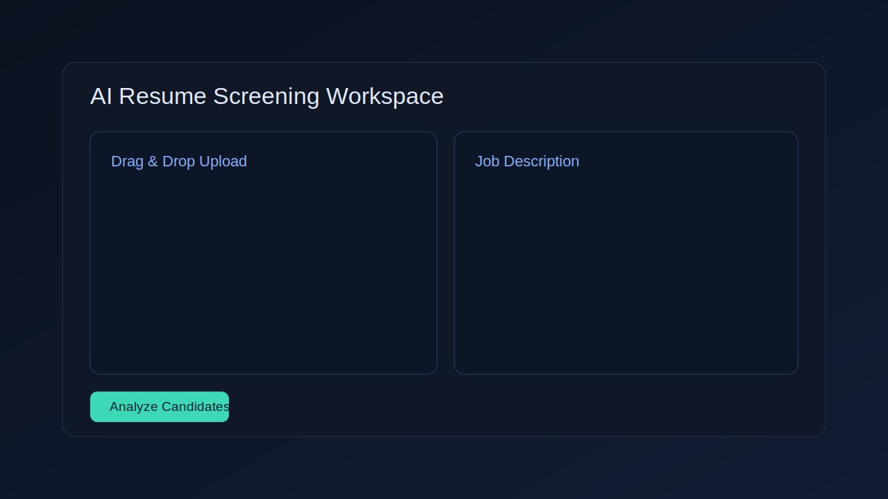

# AI Resume Screening System

[](index.html)
[](https://pages.github.com/)
[](script.js)

Portfolio-ready resume screening project with a modern static demo built for GitHub Pages. No backend or build step required — open directly in a browser.

## Live Demo

**https://kskreddy2k7.github.io/ai-resume-screening-system/**

> Replace `kskreddy2k7` with your GitHub username if you fork this repository.

## Features

- Drag-and-drop resume uploads (`.pdf`, `.doc`, `.docx`, `.txt`)
- Job description input area
- JavaScript-based keyword-matching scoring (no backend required)
- Animated progress bars and rank labels
- Ranked candidate list with matched / missing skill tags
- Professional dark AI-style interface with responsive layout

## Screenshots




## Repository Structure

```text
ai-resume-screening-system/
├── index.html                   # Main page (served as GitHub Pages root)
├── style.css                    # Dark-theme stylesheet
├── script.js                    # Scoring simulation (pure JavaScript)
├── assets/                      # Screenshots and static assets
│   ├── screenshot-home.svg
│   └── screenshot-results.svg
├── .github/workflows/deploy.yml # GitHub Pages deployment workflow
├── README.md
└── .gitignore
```

## GitHub Pages Setup

Deployment is automated via GitHub Actions. Follow these steps once:

1. Open your repository on GitHub.
2. Go to **Settings → Pages**.
3. Under **Source**, select **GitHub Actions**.
4. Push to the `main` branch (or click **Run workflow** manually in the **Actions** tab).
5. Wait for the **Deploy AIResume to GitHub Pages** workflow to complete (≈ 30 s).
6. Your site is live at `https://<username>.github.io/<repository-name>/`.

## Quick Local Preview

```bash
git clone https://github.com/kskreddy2k7/ai-resume-screening-system.git
cd ai-resume-screening-system
python -m http.server 8080
```

Open `http://localhost:8080`.

## Technologies

- **Frontend**: HTML5, CSS3, Vanilla JavaScript
- **Deployment**: GitHub Actions, GitHub Pages
